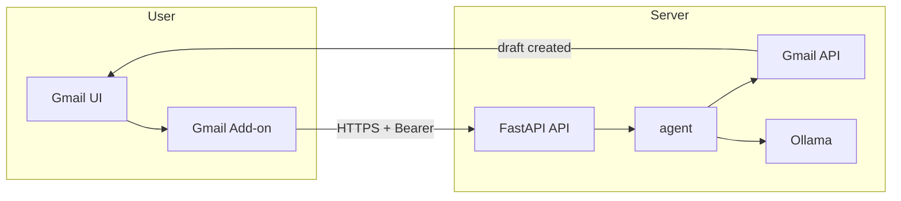
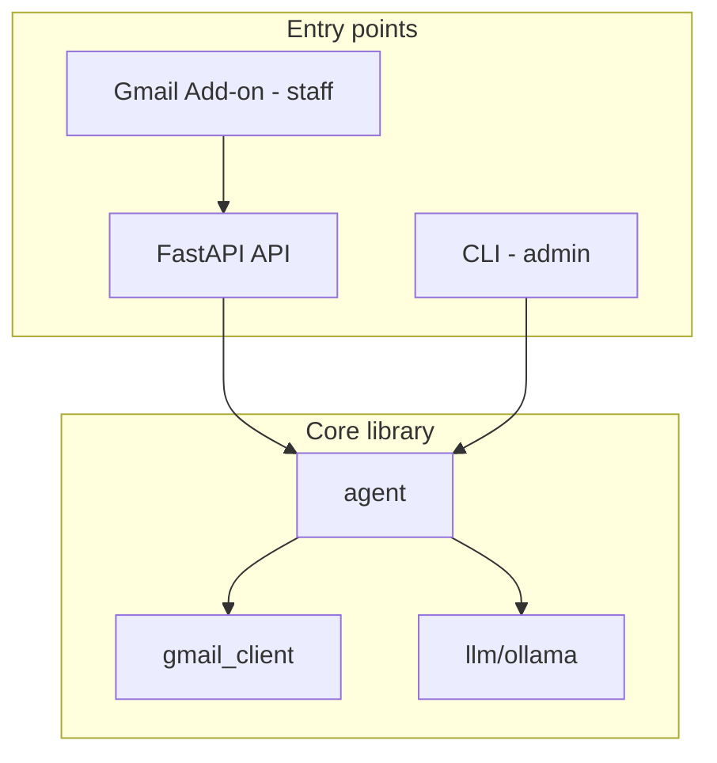

# Email Response Agent for Gmail (Travel Agency, Cusco)

## Goals

- **Draft-only**: Create reply drafts in Gmail via the Gmail API; never call send (enforced in code and scopes where possible).
- **Multilingual**: Understand and reply in Italian (primary), Spanish, and English; travel/Peru/Cusco context.
- **Triggers**: (1) Manual: pick an email and trigger “Draft reply”; (2) Automatic: background job finds new travel-related emails and creates drafts.
- **LLM**: **Self-hosted only** via **Ollama**. Reply generation for both triggers; classification only in automatic flow, kept **intentionally simple** so it doesn't become the complex part of the project.
- **Server model**: One computer **acts as the server** (runs the app + Ollama). Users are on **other machines** and access the app via the **Gmail Add-on** (button inside Gmail) — no separate web UI; staff stay in Gmail. The server must be **reachable via the internet** (e.g. port forwarding, dynamic DNS, or VPS). **Security is required**: HTTPS and authentication (e.g. Bearer token) so only the Add-on and authorized callers can use the API.

## Architecture

(Scanner and CLI also call the same backend/agent; not shown.)

- **Gmail layer**: OAuth2 (installed-app flow for dev), list messages, get message/thread, create draft reply with correct MIME (In-Reply-To, References, Re:, threadId). Use minimal scopes: read + compose (no send calls in code).
- **LLM layer**: **Ollama only**. Single implementation for (1) **Reply generation** (used by both triggers): “Generate a reply in the same language (IT/ES/EN), travel agency in Cusco.” (2) **Classification** (used only in automatic flow): “Is this email travel-related?” — **keep this simple** (e.g. one short prompt, yes/no + optional language); do not over-engineer.
- **Orchestration**: **Manual**: given message id → fetch message → detect language → generate reply → create draft (no classification). **Automatic**: list recent unread → for each, simple classification → if travel-related, same “generate reply → create draft” flow.

### App architecture (what actually runs)

- **Gmail Add-on is the primary user-facing interface.** Staff use Gmail as usual; a **Google Workspace Add-on** (Apps Script) adds a "Draft reply" button when viewing an email. No separate web UI — no new learning curve. The Add-on sends the current message ID to the backend over HTTPS with a Bearer token; the backend creates the draft in Gmail via the Gmail API.
- **Backend**: **FastAPI API-only** — no list-emails web page for staff. Exposes at least `**POST /draft-reply`** with body `{ "message_id": "..." }`; requires `Authorization: Bearer <token>`. Optional `GET /emails` for admin/CLI. Run with `uvicorn`; bind to **0.0.0.0**. HTTPS and Bearer auth required (see Security).
- **Layout**: Shared **core library** (Gmail client, Ollama client, agent orchestration) used by:
  - **Gmail Add-on** (Apps Script): Contextual trigger in Gmail; "Draft reply" button; calls `POST /draft-reply` with `message_id` and Bearer token. Lives in `addon/` in this repo or a separate repo.
  - **FastAPI**: API for the Add-on (and optionally CLI). No HTML/frontend for staff.
  - **CLI**: For server-side admin (e.g. `list`, `draft-reply <id>`, `scan`).
  - **Scanner**: Runs on the server (background loop or cron). Same core; creates drafts for new travel-related mail.
- **Summary**: Core library + **Gmail Add-on** (primary for staff) + **FastAPI API** (called by Add-on) + CLI (admin) + scanner.

## Implementation Plan

### 1. Dependencies and environment

- **pyproject.toml**: Add dependencies: `google-api-python-client`, `google-auth-oauthlib`, `google-auth-httplib2`, and `**ollama`** (official Ollama Python client, PyPI: [ollama](https://pypi.org/project/ollama)). Use `uv add ollama`. No raw HTTP client needed for Ollama; the package provides `ollama.chat()`, `ollama.generate()`, and `Client(host=...)` for custom base URL.
- **.env** (and `.env.example`): 
  - `GMAIL_CREDENTIALS_PATH` (e.g. `credentials.json` for OAuth client secrets).
  - `GMAIL_TOKEN_PATH` (e.g. `token.json` to store refresh token).
  - Ollama: `OLLAMA_BASE_URL` (default `http://localhost:11434`), `OLLAMA_MODEL` (e.g. `llama3.2`, `mistral`). No API key.
- Auth: `**AUTH_BEARER_TOKEN`** for API (Add-on and CLI call the backend with `Authorization: Bearer <token>`). Required when the server is internet-facing. Optional: `WEBAPP_USERNAME`/`WEBAPP_PASSWORD` for HTTP Basic if you add an admin page later.
- **.gitignore**: Ensure `credentials.json`, `token.json`, and `.env` are ignored (`.env` already in place).

### 2. Gmail integration

- **OAuth**: Use `google-auth-oauthlib` with a local server or out-of-band flow; request scopes `https://www.googleapis.com/auth/gmail.readonly` and `https://www.googleapis.com/auth/gmail.compose` (no `gmail.send` needed for creating drafts). Persist tokens in `token.json`.
- **Service wrapper** (e.g. in `gmail/` or `src/gmail/`): 
  - List messages (optional `q`, e.g. `is:unread`, `maxResults`).
  - Get message by id (full payload, body decoded).
  - Create draft reply: build MIME message with From/To/Subject (Re:), In-Reply-To, References, same `threadId`; base64url encode; call `users.drafts.create` with `userId='me'`. Do not implement or call `drafts.send` or `messages.send`.
- **Docs**: Add a short README section on creating a project in Google Cloud Console, enabling Gmail API, and downloading OAuth client secrets as `credentials.json`.

### 3. LLM (Ollama only)

- **Implementation**: Use the **official `ollama` Python package** ([ollama-python](https://github.com/ollama/ollama-python)): `ollama.chat()` or `ollama.generate()` with `Client(host=OLLAMA_BASE_URL)` and `OLLAMA_MODEL` from env.
- **Reply generation** (used by both manual and auto): `def generate_reply(original: str, language: str, context: str) -> str`. Context: “Cusco travel agency, Peru, primary clients Italian.” (Uses the `ollama` package as above.)
- **Classification** (used only by automatic flow): `def is_travel_related(body: str, subject: str) -> tuple[bool, str]`. **Keep it simple**: one short prompt (e.g. “Is this email about travel, tours, or trips to Peru? Reply yes or no and the language code.”), no multi-step reasoning or heavy structure. Goal is to avoid false positives in auto-drafting, not to be perfect.
- Config: `OLLAMA_BASE_URL`, `OLLAMA_MODEL`; optional startup check that base URL is reachable (e.g. `ollama.list()` or catch connection errors on first use).

### 4. Core agent logic

- **Draft flow (no classification)**: Given message id: fetch message → extract body/headers and detect language → `generate_reply` → create draft via Gmail (same thread, proper headers). Use this for **manual** trigger (UI/CLI); human has already chosen the email.
- **Automatic flow**: Loop (or cron): list recent unread → for each message, **simple** `is_travel_related` → if yes, run draft flow above; if no, skip. Track processed message ids to avoid re-drafting. Interval configurable (e.g. 15–30 min). Classification stays minimal so it doesn’t become the complex part of the project.

### 5. Manual trigger (Gmail Add-on + CLI)

- **Gmail Add-on (primary for staff)**: When viewing an email in Gmail, the Add-on shows a "Draft reply" button. User clicks it; Add-on sends the current `message_id` to the backend `POST /draft-reply` with Bearer token. Backend runs the draft flow (no classification); draft appears in Gmail. No new UI — staff stay in Gmail.
- **CLI (admin)**: e.g. `uv run python -m wayonagio_email_agent.cli list` (recent N emails); `uv run python -m wayonagio_email_agent.cli draft-reply <message_id>`. Draft reply uses **draft flow only** (no classification).
- “Draft reply” calls the same draft flow (no classification). Phase 2 if desired.

### 6. Safety and rollout

- **No send**: No code path calls `drafts.send` or `messages.send`; only `drafts.create`. In README, state that the app is “draft-only” and that sending must be done by the user in Gmail.
- **Initial rollout**: Run automatic scanner with a conservative interval and/or only for unread; consider a “dry run” mode that logs what would be drafted without creating drafts.

### 7. Project layout (suggestion)

- **Backend**: `src/wayonagio_email_agent/` (or flat): `gmail_client.py`, `llm/ollama.py`, `agent.py`, `api.py` (FastAPI **API-only**: `POST /draft-reply`), `cli.py`. Run FastAPI with `uv run uvicorn wayonagio_email_agent.api:app --host 0.0.0.0`. CLI and scanner as subcommands or separate script.
- **Gmail Add-on**: Separate folder `**addon/`** in this repo (or separate repo): Apps Script project with `appsscript.json`, `Code.gs`, Gmail contextual trigger, HTTP request to backend with Bearer token. Document in README how to deploy and install for the Workspace domain.

### 8. Hosting / Run model (server)

- **Server**: One computer runs the app and Ollama and **acts as the server**. It is **reachable via the internet** (e.g. port forwarding, dynamic DNS, or VPS with public IP). Users connect from anywhere. `OLLAMA_BASE_URL` is local on the server (e.g. `http://localhost:11434`). No cloud deployment of the app itself.
- **FastAPI server**: Run with `uvicorn` bound to **0.0.0.0**. Put the app behind a **reverse proxy** (e.g. Caddy, Nginx) that terminates **HTTPS** (e.g. Let's Encrypt) and forwards to the app. Do not expose plain HTTP to the internet.
- **Scanner**: Run on the server as a background process or cron job. Same machine as the FastAPI app and Ollama.
- **README**: Document server setup, internet reachability, reverse proxy + HTTPS, and authentication (see Security).

### 9. Security (internet-facing)

Because the server is reachable via the internet, the following are **required**:

- **HTTPS/TLS**: All traffic between clients and the server must be encrypted. Run the FastAPI app behind a reverse proxy (e.g. Caddy or Nginx) that handles TLS (e.g. Let's Encrypt). The app listens on localhost or a private port; the proxy listens on 443 and forwards to the app. No plain HTTP on a public interface.
- **Authentication**: Every API endpoint (e.g. `POST /draft-reply`) must require authentication. For the **Gmail Add-on**, **Bearer token** is the natural fit: Add-on stores the token (e.g. in Apps Script script properties) and sends `Authorization: Bearer <token>`; backend validates against `AUTH_BEARER_TOKEN` in `.env`. No login page needed for staff. Optional for admin: HTTP Basic or session login if you add an admin page later.
- **Secrets**: Store credentials (Gmail OAuth secrets, auth passwords/tokens) in `.env` or a secret store only; never in code or in the repo. Restrict file permissions on the server for `.env` and `credentials.json`.
- **Optional hardening**: Rate limiting on login and API routes; CORS restricted to your front-end origin if applicable; security headers (HSTS, etc.) via the reverse proxy. Keep dependencies updated.
- *Obsolete: removed duplicate scanner bullet.* on that machine, e.g. `uv run python -m wayonagio_email_agent scan --interval 30` (sleeps between runs), or invoke via **cron / Task Scheduler** (e.g. every 15–30 min) so the script runs once per interval and exits. No need for a separate “server”; the scanner loop or cron is the host model.

## Out of scope (for later)

- **Gmail Add-on**: A true “button inside Gmail” would require a Google Workspace Add-on (Apps Script/JS). The current design gives a “Draft reply” action via CLI or web UI; an Add-on could later call this backend via HTTP if desired.
- **Actually sending mail**: Explicitly excluded; only drafts.

## Key files to add/change

| Area     | Files                                                                                      |
| -------- | ------------------------------------------------------------------------------------------ |
| Config   | [pyproject.toml](pyproject.toml), [.env](.env) (or .env.example), [.gitignore](.gitignore) |
| Gmail    | New: credentials handling, `gmail_client` or `gmail/service.py`                            |
| LLM      | New: `llm/base.py` (interface), `llm/ollama.py` (Ollama-only implementation)               |
| Agent    | New: `agent.py` (single-email + batch loop)                                                |
| Triggers | New: FastAPI `api.py` (web UI / API), `cli.py` (admin), scanner script or subcommand       |
| Docs     | README: setup, Gmail OAuth, env vars, usage, server hosting, HTTPS, auth                   |
| Security | Auth middleware/dependency in FastAPI; .env for auth secrets; README for reverse proxy+TLS |

## Order of implementation

1. Dependencies (include FastAPI, uvicorn), .env.example (add `AUTH_BEARER_TOKEN`), and .gitignore updates.
2. Gmail OAuth and draft-creation only (no send).
3. LLM: Use official **ollama** package; implement `generate_reply` and (for auto only) simple `is_travel_related`.
4. Agent: single-email flow then automatic loop.
5. **FastAPI API**: `POST /draft-reply` (and optional `GET /emails` for admin). **No** staff web UI. Auth: Bearer token dependency.
6. Security: Bearer token validation on API; document reverse proxy + HTTPS in README.
7. **Gmail Add-on**: Apps Script project in `addon/` — contextual trigger, "Draft reply" button, call `POST /draft-reply` with `message_id` and Bearer token. Deploy and document installation for Workspace domain.
8. CLI (admin): list, draft-reply; scanner subcommand or script.
9. README: server setup, Add-on setup (backend URL + token, install for domain), internet reachability, reverse proxy + HTTPS, auth, optional dry-run for scanner.

